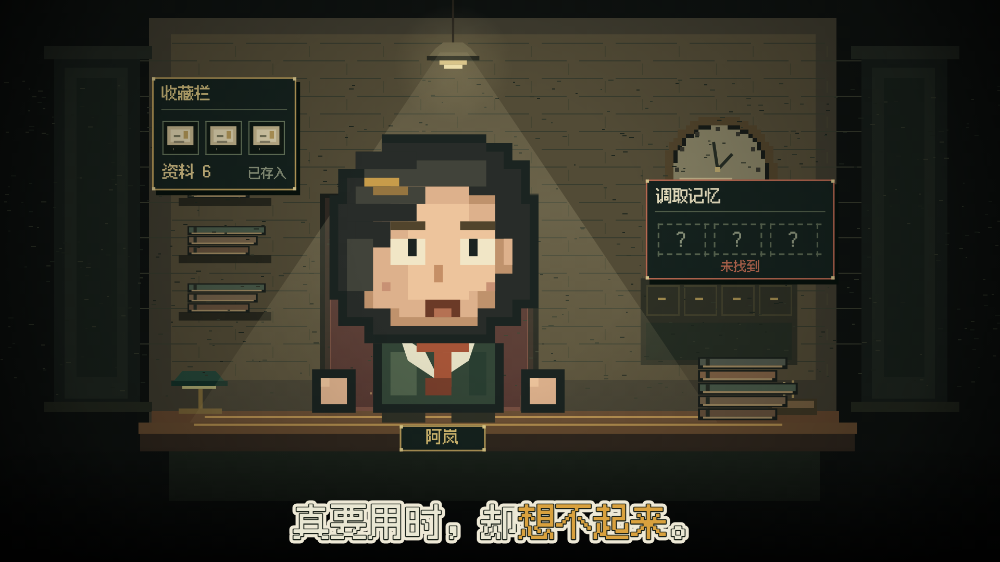
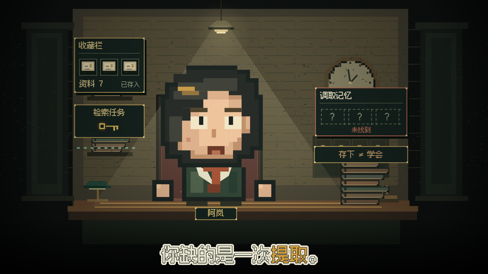
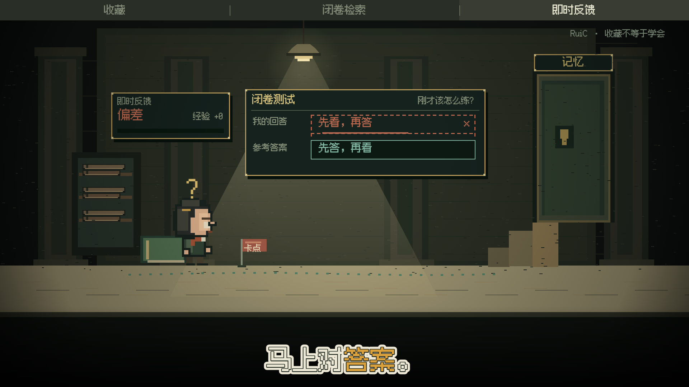
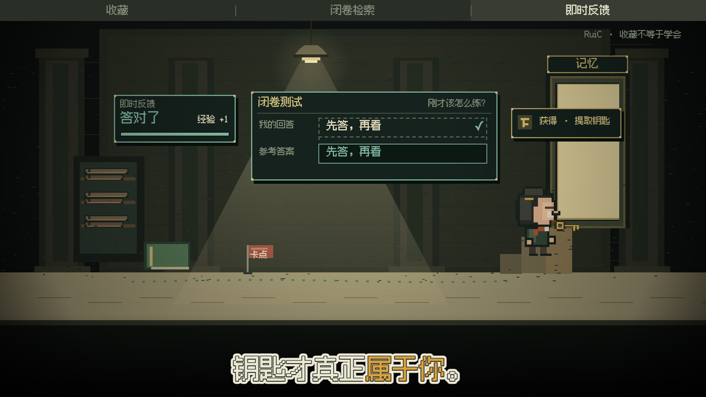

# ✦ RuiC Pixel Explainer

> 一条**粗像素电影式讲解片**生成产线（Agent Skill）：给一段口播文案，产出带配音的 **1920×1080 / 30fps** 横屏像素讲解片（MP4）+ 一份可改的工程。
> 知识点被演成像素世界里的动作：资料卡飞进收藏栏、检索槽查不到内容、合上笔记答题、卡点被标记、答案对照、经验条与钥匙奖励。

源流派：像《刻意练习》＝"神"的武器那一类像素游戏风读书讲解片。
本仓库把这种风格做成**可复现产线**：画面是**时间的纯函数**，逐帧导出、逐帧确定（同帧截两次字节必须一致），不靠录屏。

---

## 🎬 演示 ·《收藏不等于学会》20 秒

<!-- 内联播放：等 MOV 传成 GitHub 附件后，这里放一行尖括号链接（GitHub 会自动渲染成播放器） -->
[▶ 观看成片（20.0s / 600 帧 / 1920×1080 / 30fps，带声音）](example/demo-20s.mov)

剪映「真人播客女」音色（`zh_female_mizai_saturn_bigtts`），逐句合成后 1.08 倍速；字幕与说话区间按各句实测时长排。

> **大人物 0–10 秒**：收藏了一堆干货，真要用时，却想不起来。／ 存下来，不等于学会了。／ 你缺的，是一次提取。
> **小人物 10–20 秒**：合上笔记，先答一道题。／ 卡住做标记，马上对答案。／ 答出来，钥匙才真正属于你。

| 大人物 · 修理铺开场 | 资料入库 → 检索不到 | 小人物关卡 · 标记卡点 | 对答案 → 拿到钥匙 |
|---|---|---|---|
|  |  |  |  |

这一版新增的内容动作：资料卡飞入并增加库存 → 检索槽查不到内容 → 库存与能力形成对照 → 合上笔记出题 → 错误尝试被标记 → 展开参考答案 → 修正后获得经验 → 奖励钥匙与开门。
反馈板与题目板**和人物行走路径错开**，奖励文字按卡片宽度适配。工程全套在 [`example/`](example/)（`episode.json` 存文案与事件、`scene.mjs` 绘人物场景、`components.mjs` 是可复用组件）。

---

## 🧩 它怎么工作


**关键一点**：一切画面都只吃一个变量 `t` —— 所以导出不靠录屏，把 `t` 钉在 `n/30` 秒上截图喂给 ffmpeg 即可；
判定标准是**同帧重截字节一致**（墙钟 CSS 动画与 `Math.random()` 不许进入录制画面）。

## 🛣 两条工程路由

| 路由 | 适合 | 说明 |
|---|---|---|
| **① `assets/cinematic-template/`**（技能自带） | 大人物开场＋小人物演示、要求接近参考片质感 | 原生 1920×1080 Canvas 粗像素样板；人物 / 后景 / 道具 / 前景 / 灯光 / HUD / 字幕各自独立绘制；自包含（含 pixel 字体与 20 秒示范配音），复制走再改 |
| **② `~/Desktop/zcode/ai-explain-game/game/`**（React 工程） | 完整地图、选择题、评分、通关流程 | 沿用它的 `SceneDef` / `Pack` 接口。⚠️ 那套 14×21 小精灵**只适合小人物**，别直接放大当大人物特写 |

## 🎨 视觉定标（粗像素）

**三档分辨率不要混成一种**（1080p 里的建议尺度）：

| 层 | 尺度 | 用途 |
|---|---|---|
| 大人物 | 主体 400–620 px 高；脸 280–400 px；色块 12–20 px | 情绪与开场 |
| 小人物 | 主体 130–220 px 高；色块 4–8 px | 在世界里演步骤 |
| 环境 | 建筑 60–180 px 大体块；细线少而低对比 | 深度与位置 |

- **大人物是独立肖像**：大块头发、方眼白＋瞳孔、眉毛与嘴，头占身高 55%–70%，有肩膀与方手 —— 不是小精灵硬放大。
- **小人物是同一人的行动版**：保留发型/衣色/配件，至少有侧身、站立与两帧走路。
- **光与色**：暖主光约 `#d8c58c`，外围近黑棕或灰绿；皮肤 `#edc49c`/`#ddb18c`/`#bf926c`；轮廓 `#19221e`；金边与关键词 `#cfab57`/`#d9a13e`；青绿只给反馈或路径。每场一个主光源，前景桌边挡腿、道具不挡脸、字幕占最后层。
- **字幕**：本地 Fusion Pixel，通常 60–72 px，纸白外描边＋暗内描边＋**一个金色关键词**；单行居中，超宽按语义拆拍。用真实中文文本预载分包字体（只传拉丁会拿系统字兜底）。
- **HUD 服务场景**：大人物开场可以先不给章节轨；进小人物关卡再出现导航与署名 —— 不是每镜都塞满导航＋地点卡＋进度＋状态卡。

## ⚙️ 命令

```bash
# 起一个本期工程：复制模板再改
cp -R assets/cinematic-template <本次项目目录>
python3 <本次项目目录>/serve.py --port 8778 --open

# 口播两步走：先量真实时长，再按时间码拼整条音轨
python3 scripts/voice_track.py --lines lines.json     --work <work> --tts-only
python3 scripts/voice_track.py --lines lines-abs.json --work <work> --out voice.wav

# 静帧预检 → 逐帧出片（1280×720 视口 × dsf 1.5 直接得到 1920×1080，不经过放大柔化）
node scripts/stills.mjs       --url http://127.0.0.1:8778/ --out stills --times 1.6,6.2,10.5,14.8,18.4 --dsf 1.5
node scripts/render_episode.mjs --url http://127.0.0.1:8778/ --out sample.mp4 --audio voice.wav \
     --fps 30 --dsf 1.5 --size 1920x1080 --threads 2
```

## 📦 目录

```
RuiC-pixel-explainer/
├─ SKILL.md                     技能主文件（放进 ~/.agents/skills/ 就能被 Agent 调用）
├─ references/
│  ├─ style-dna.md              视觉定标：三档分辨率 / 人物 / 场景密度 / 光色 / 字幕字体
│  ├─ cinematic-profile.md      自带样板的配方（人物参数、镜头切点、说话区间）
│  ├─ teaching-components.md    讲解组件与语义事件（怎么做"有东西在演"）
│  ├─ reference-modes.md        原创参考 vs 素材恢复两条口径
│  └─ pipeline.md               工程接法（含 React 游戏工程那条路由）
├─ scripts/
│  ├─ voice_track.py            逐句 TTS（剪映音色）→ 量时长 → 按时间轴拼一条音轨
│  ├─ render_episode.mjs        逐帧导出（自带同帧重截一致性检查）
│  └─ stills.mjs                静帧质检（渲片前必跑）
├─ assets/
│  ├─ cinematic-template/       自包含粗像素样板（原生 1920×1080 + 字体 + 20s 示范配音）
│  └─ wechat-donate.png
└─ example/                     本期《收藏不等于学会》的成片 + 可改工程 + 关键静帧
```

## 🔧 装到本机

```bash
cp -R RuiC-pixel-explainer ~/.agents/skills/ruic-pixel-explainer     # 技能权威源
python3 ~/.agents/registry/deploy_skills.py --sync                   # 软链给 claude / codex
python3 ~/.agents/registry/gen_registry.py                           # 刷新能力注册表
```

## 声明

- **原创片没有逐帧 RGB 一致性承诺**：视觉参考只作风格与规格依据；只有实际采用恢复像素并完成校验时，才可以报告像素一致性。
- 本条样片的口播用剪映内置音色合成，未使用任何真人录音；画面全部由代码绘制。

## 赞赏支持

<div align="center">
  
  <p><strong>微信扫码赞赏</strong></p>
</div>
