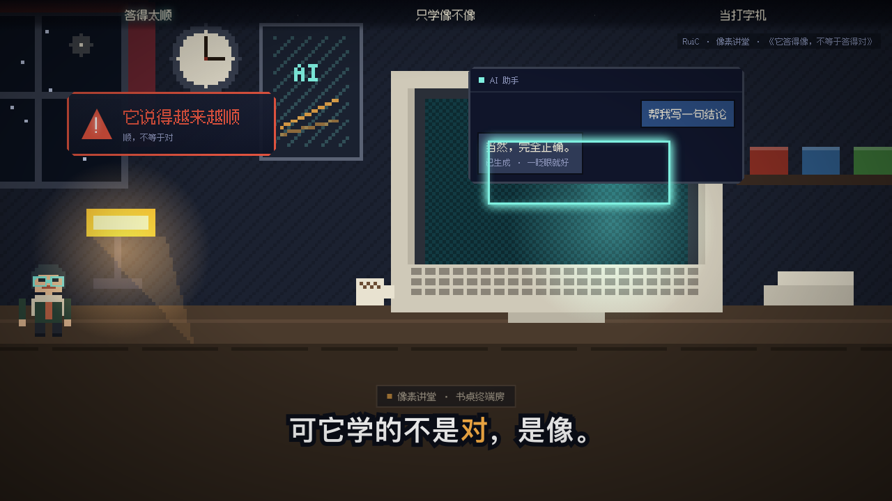
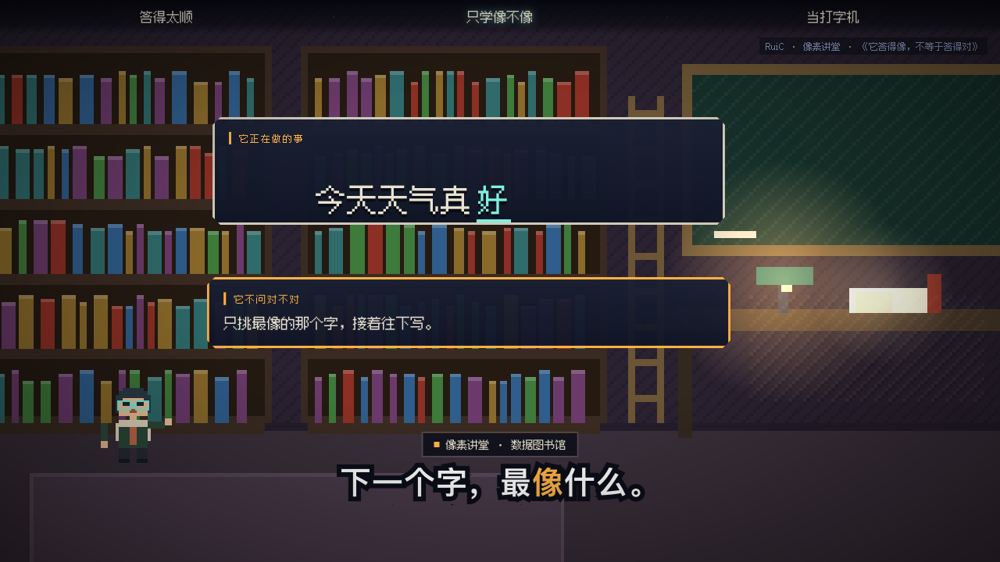
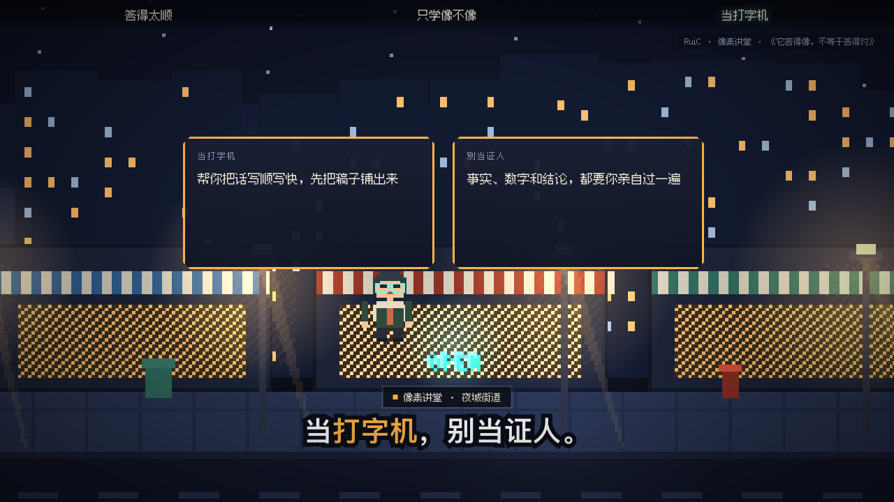
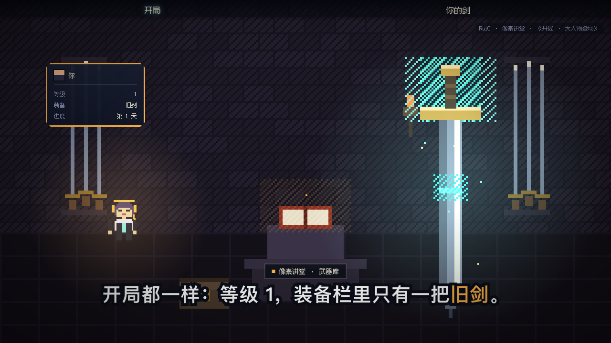

# ✦ RuiC Pixel Explainer

> 一条**像素游戏化讲解片**生成产线（Agent Skill）：给他一段口播文案，产出一条 **1920×1080 / 30fps** 的像素 RPG 讲解短片 ——
> 顶部章节轨、底部单行字幕（每句 1 个橙色关键词）、地点卡、右上署名、像素小人演知识、相机推近停稳。
> 自动播放时像视频，可动手时像小游戏（关卡地图 / 选项卡 / 评分 / 通关徽章）。

源流派：像素游戏风读书讲解片（《刻意练习》＝"神"的武器、《被讨厌的勇气》《纳瓦尔宝典》那一类）。
本仓库是"把这种风格做成可复现产线"的工程化版本：**画面是时间 t 的纯函数，所以能逐帧导出、逐帧可复现**，不靠录屏。

---

## 🎬 演示

两支片子都是这条产线现做的，含剪映音色配音（30fps / 1920×1080）：

### 样片 1 ·《它答得像，不等于答得对》— 15.0 秒 / 3 场

3 句口播讲一件事：大模型练的是"下一个字最像什么"，所以它答得顺，不等于答得对。

[▶ 观看成片（15.0s）](example/样片1-它答得像不等于答得对-1080p30.mp4)

| 答得太顺（`ChatMock` + `NeonSelect`） | 只学像不像（`FillBlank`） | 当打字机（`CompareCards`） |
|---|---|---|
|  |  |  |

### 样片 2 ·《开局 · 大人物登场》— 10.4 秒 / 2 场

开局场面：巨剑插地、灵气上升、属性面板（等级 1 / 装备 旧剑），然后推成大特写收尾。

[▶ 观看成片（10.4s）](example/样片2-开局大人物登场-1080p30.mp4)

| 开局（巨剑 + 属性面板） | 大特写 | 光环收尾 |
|---|---|---|
|  |  |  |

---

## 🧩 它怎么工作


**关键一点**：播放器里的一切画面（像素舞台、元素入场、字幕、章节轨）都只吃一个变量 `t`。
所以导出器不需要"录屏"——把 `t` 逐个钉在 `n/30` 秒上截图，按序喂给 ffmpeg，得到的就是**逐帧确定**的成片；
同一帧截两次字节一致，随时可复现、可回滚。

## 🚀 五步

| 步 | 做什么 | 产出 |
|---|---|---|
| 1 | 文案整理：一句一行，字幕＝口播，每句 ≤22 汉字、只 1 个 `[[关键词]]` | 口播稿 |
| 2 | 事实核查：数字 / 术语 / 年份 / 人名逐个找出处，核不到就删或标"示意" | 出处清单 |
| 3 | 分镜：一句一场景（背景 / 主角 / 主元素 + 出场口播词 / 字幕 / 运镜 / 光源） | 分镜表 |
| 4 | 场景代码：内容文件 + 场景文件 + 注册一期 | 可跑工程 |
| 5 | 配音定轴 → 逐帧导出 | MP4 + 静帧 |

```bash
# 配音：先量真实时长，再按时间码拼一条整轨（剪映音色）
python3 scripts/voice_track.py --lines lines.json     --work work --tts-only
python3 scripts/voice_track.py --lines lines-abs.json --work work --out voice.wav

# 出片：先静帧预检，再整片导出
node scripts/stills.mjs       --url http://127.0.0.1:5274/ --ep <slug> --out stills --times 1.2,3.9,7.6
node scripts/render_episode.mjs --url http://127.0.0.1:5274/ --ep <slug> \
     --out "<片名>.mp4" --audio voice.wav --fps 30 --dsf 2 --size 1920x1080
```

## 🎨 视觉 DNA（写进代码的常量，别自己调）

| 件 | 规格 |
|---|---|
| 三件套 | 顶部章节轨（当前章亮字）· 底部单行字幕（≤22 汉字，1 个橙色 `#ffb347` 关键词）· 右上署名；外加地点卡 |
| 像素 | 艺术坐标 320×180 → 缓冲 640×360 → 最近邻放大；成片 1920×1080 = 艺术格 ×6 |
| 调色板 | 夜空 `#141a2e` / `#1d2540`、暖光 `#ffbc6b`、霓虹青 `#7ff0e0`、重点橙 `#ffb347`、危险红 `#e0533f`、纸 `#e8e2d0` |
| 字体 | 场景内 Fusion Pixel 12px（OFL-1.1，只允许整数倍字号）；字幕用系统粗体 + 描边 |
| 光源 | 每场景一个主光源 + 暗角，主角站在光里；禁止无光平铺 |
| 主角 | 同一剪影 + 可换皮肤表（`classic` / `archivist` 夜班档案员 / `host` 深夜电台）× 配饰（眼镜 / 耳机 / 鸭舌帽）|
| 镜头 | 推近 1.2–2.5 秒**动完停稳**，不许整段慢漂移 |

**硬规矩**：一句口播一个场景（6–14 秒）· 元素出场锚定口播词 · 画面不空不挤要丝滑 · 结尾单独设计 ·
字幕永远单行 · 数字必须有出处 · 不出现金额数字与具体大模型产品名 · 每期换款（多号分发要看出不同源）。

## 📦 目录

```
RuiC-pixel-explainer/
├─ SKILL.md                 技能主文件（放进 ~/.agents/skills/ 就能被 Agent 调用）
├─ references/
│  ├─ pipeline.md           施工细节：分镜表 / SceneDef 与元素 API / 配音定轴 / 出片参数 / 10 条坑
│  └─ style-dna.md          视觉 DNA：三件套 / 调色板 / 字体 / 光源 / 叙事骨架 / 元素库
├─ scripts/
│  ├─ voice_track.py        逐句 TTS（剪映音色）→ 量时长 → 按时间轴拼一条音轨
│  ├─ render_episode.mjs    逐帧导出成片（自带"同帧截两次字节一致"的确定性自检）
│  └─ stills.mjs            静帧质检（渲片前必跑）
├─ example/                 本期两支样片的全部源码 + 成片 + 静帧
└─ assets/wechat-donate.png
```

## 🔧 装到本机

```bash
cp -R RuiC-pixel-explainer ~/.agents/skills/ruic-pixel-explainer     # 技能权威源
python3 ~/.agents/registry/deploy_skills.py --sync                   # 软链给 claude / codex
```

引擎（像素舞台 / 元素库 / 播放器）是本机 `ai-explain-game` 工程，仓库里只放**产线**（技能 + 脚本 + 样板源码）。
`example/` 里的两个 `.ts/.tsx` 直接丢进那套工程的 `src/content/` 与 `src/scenes/` 即可复现这两支片子。

## 赞赏支持

<div align="center">
  
  <p><strong>微信扫码赞赏</strong></p>
</div>
